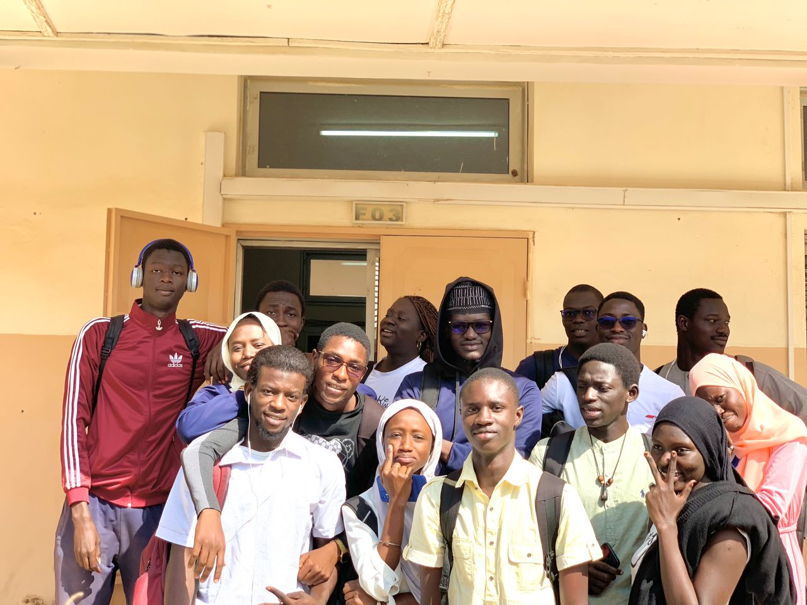
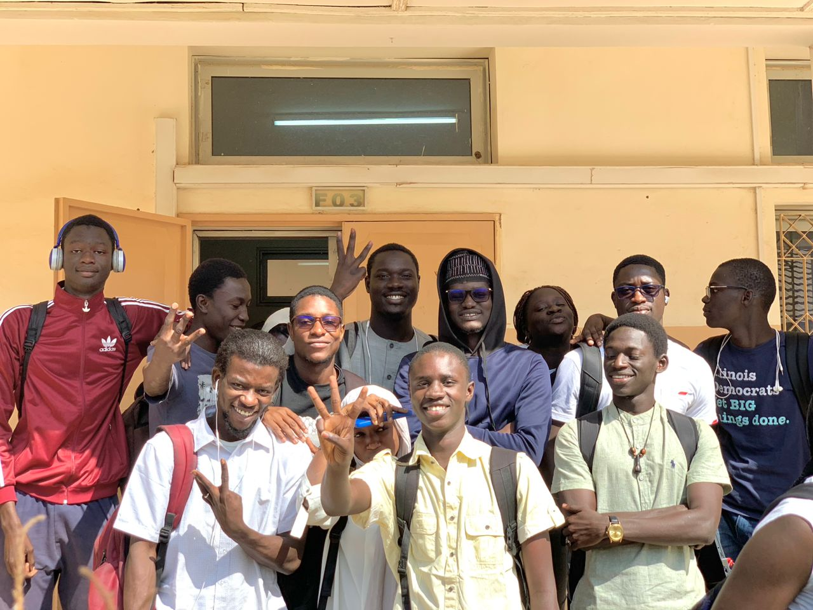
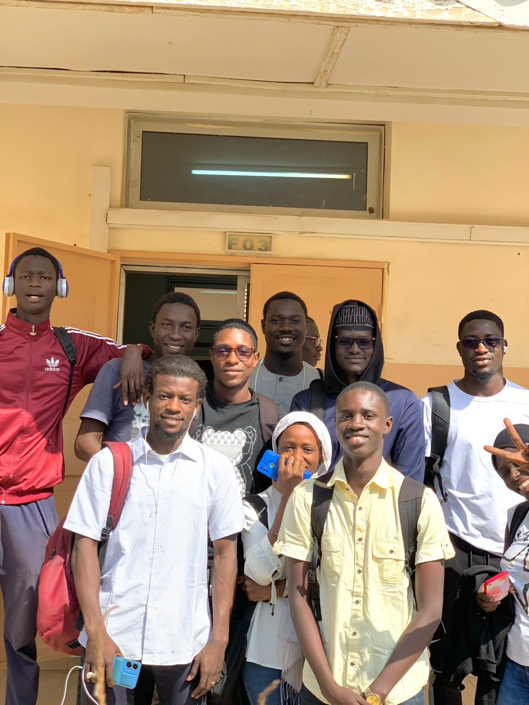
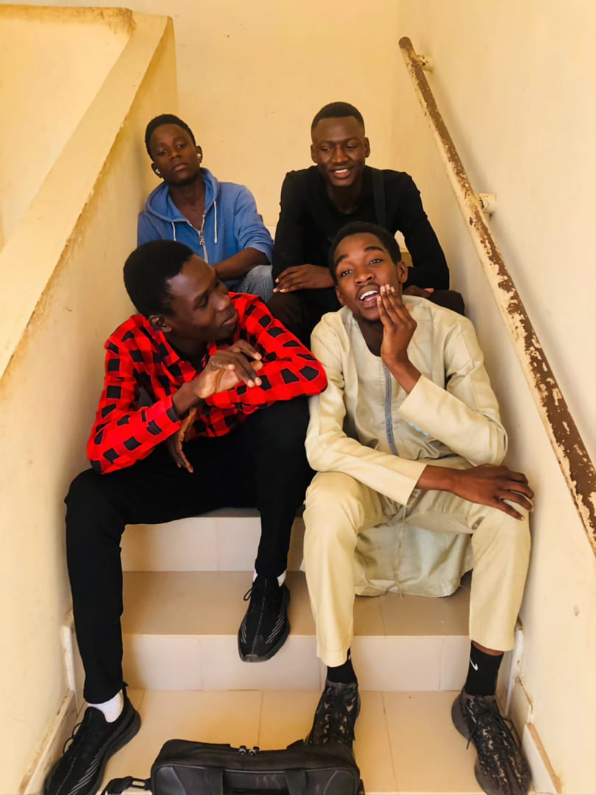

# Cours-L2I-Promo-1

Bienvenue dans le repository des cours de la première promotion de la Licence en Ingénierie Informatique (L2I). Vous trouverez ici l'ensemble des cours organisés par année et semestre.

## Pour télécharger tous les documents

Appuyez sur le bouton vert **<> Code** puis téléchargez-le en fichier Zip.

## Structure du repository

Ce repository contient les cours de la Licence en Ingénierie Informatique répartis sur trois années académiques.

### Année 1 : 2020 - 2021

- **Semestre 1**
- **Semestre 2**

### Année 2 : 2021 - 2022

- **Semestre 3**
- **Semestre 4**

### Année 3 : 2022 - 2024

- **Semestre 5**
- **Semestre 6**

## Utilisation

Pour naviguer dans les cours, veuillez sélectionner l'année académique puis le semestre correspondant. Chaque dossier de semestre contient les matières et les ressources associées.

## Contribuer

Les contributions sont les bienvenues ! Si vous souhaitez ajouter des notes, des exercices, ou corriger des erreurs, veuillez suivre les étapes suivantes :

1. Fork le repository.
2. Créez une branche pour votre modification (`git checkout -b feature/nom-de-la-fonctionnalite`).
3. Effectuez vos changements et committez-les (`git commit -m 'Ajout d'une fonctionnalité'`).
4. Poussez la branche (`git push origin feature/nom-de-la-fonctionnalite`).
5. Ouvrez une Pull Request.

## Respect des droits d'auteur

Les cours partagés dans ce repository appartiennent aux professeurs qui les ont créés. Ils sont partagés ici à des fins éducatives et doivent être utilisés dans le respect des droits d'auteur et de la propriété intellectuelle. Veuillez ne pas distribuer ou utiliser ces documents à des fins commerciales sans l'autorisation explicite des auteurs. Utilisez ces ressources de manière éthique et respectueuse.

## Contact

Pour toute question ou suggestion, n'hésitez pas à ouvrir une issue ou à me contacter directement à gayeabdoulaye163@gmail.com.

## Mémoire de Mouhamet Rassoul Sy

Mouhamet Rassoul Sy faisait partie de cette promotion. Malheureusement, il nous a quittés durant la première année. Cet être exceptionnel mérite de rester dans nos mémoires et dans nos prières. Que Dieu lui pardonne et l'accueille dans son paradis céleste.

## Quelques photos de la première promotion

Voici quelques photos de la première promotion de la Licence en Ingénierie Informatique (L2I) :

---

Merci de votre visite et bon apprentissage !
